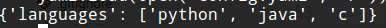

# yaml配置文件

yaml（yet another markup language），是一种以数据为中心，能被电脑和人看懂的数据序列化格式。说白了和xml，json差不多，可以用来序列化、传输数据，或者用作配置文件。

第一次看到yaml，是老师提供的一个scrapy程序中的配置文件，查阅了一些资料后，发现这种数据格式虽然远没有json，xml流行，但是应用相对还是比较广泛的，尤其是用作配置文件。yaml的可读性也是非常好的，而且被计算机解析也是十分简单，未来应用可能会越来越多。

## 语法简介

### 语法

yaml和python相似，使用缩进表示语句块层级关系，但是其缩进只允许使用空格，不允许使用tab，同一语句块需要缩进对齐。还有我发现yaml的冒号后面必须有空格，至少在Python中（PyYAML）是这样的。此外，yaml中可以用`#`表示单行注释。

### 数据类型

* 对象 键值对的集合，可以想象成python的字典
* 数组 可以想象成python的列表
* 标量 一个数值

### 标量类型支持

* 字符串
* 布尔值
* 整数
* 浮点数
* null（用`~`表示）

文字描述其实没什么用，我们直接看例子吧。

## yaml例子1 对象

这个例子是我之前看到的一个配置文件。

```yaml
#爬取的页面
tieba:
  url: http://tieba.baidu.com/f?kw=python3
  name: Python3吧
  id: 35522
#页数
page: 5
```

使用pyyaml读取看看。


显然，这里整个yaml是一个对象（字典），里面包含两个属性（键值对）：page和tieba，tieba的值又是一个对象，对象有三个属性。

注意，上面例子的字符串没有使用引号，是因为yaml中如果字符串没有空格，引号可以省略，但是我建议加上引号。

## yaml例子2 数组

```yaml
languages:
  - "python"
  - "java"
  - "c"
```



注意数组的写法，`-`开头，加上一个空格，加上数组的元素。

## yaml例子3 对象结合数组

我们自己写一个复杂点的例子，对象和数组结合使用：

```yaml
name: "Tom"
age: 10
languages:
  - name: "python"
    developer: "Guido van Rossum"
    maintainer: "python.org"
  - name: "java"
    developer: "James Gosling"
    maintainer: "oracle"
  - name: "c"
    developer: "AT&T Bell Laboratory"
```


在编写的过程中，我发现`-`后面必须有空格，`:`后面也必须有空格，否则解析器是报错的。

## 总结

写这篇笔记前，我还没搞清楚yaml的语法，我是边写笔记边学的，现在大致已经搞清楚yaml的写法了。`:`和`-`后面要加空格，这个语法着实把我坑了一下。总的来说，有点失望，yaml并不像我想象的那样好写，感觉这个语法规则比xml和json略复杂一些。

python的缩进就是备受争议的，我曾经也因为缩进被文本编辑器弄乱纠结了好一阵子，还好后来使用了pycharm。yaml也用缩进控制语句块，这一点也不太符合我的期望。
