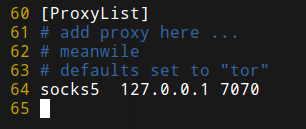

# 症状

系统配置里的代理功能根本不好使，应该是只做了菜单，根本没实现这个功能。

# 解决方法

使用proxychains，sock5代理，改下配置文件就能用了



配置文件是`/etc/proxychains.conf`

使用例子:
```
sudo proxychains apt-get update
```

换用Ubuntu16.04后不存在此问题，貌似是Cinammon桌面根本没实现那个功能。
