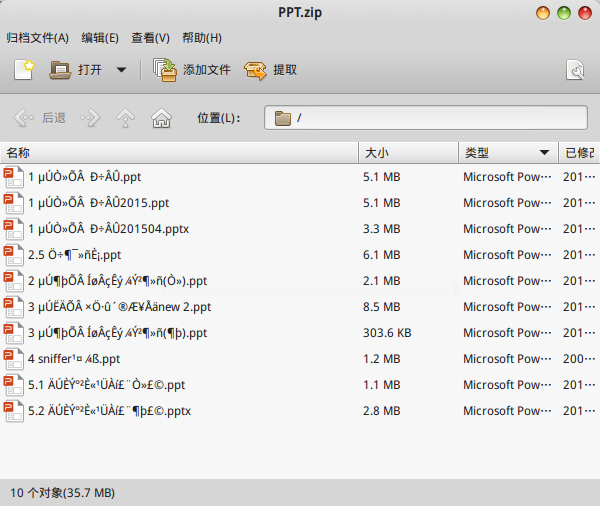
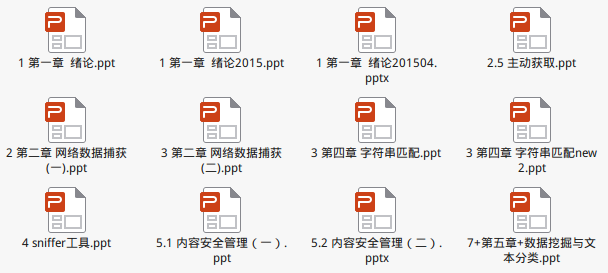

# 压缩包解压文件名乱码

很多老师上传的课件压缩包，在我电脑上解压后文件名都是乱码，根本无法阅读。目前找到了zip格式解决方案。rar格式我不确定是否有这种问题，gz等格式Windows下不会用，7z也比较少用。这里记录下zip格式的解决方案。

文件名乱码：



这是因为Windows下默认编码是GBK，而我系统（Linux默认UTF-8）上的自带默认解压软件没办法正常解析的原因。

## 解决方案

```
unzip -O GBK PPT.zip
```

* `-O`：选项：指定压缩包的文件名编码，unzip软件会自动将其转化文UTF-8。这样乱码问题就完美解决了。



## 使用unar

unar（unacheiver），是一个支持很多格式，并且支持编码转换的解压软件，直接使用unar也能解决这个问题。
