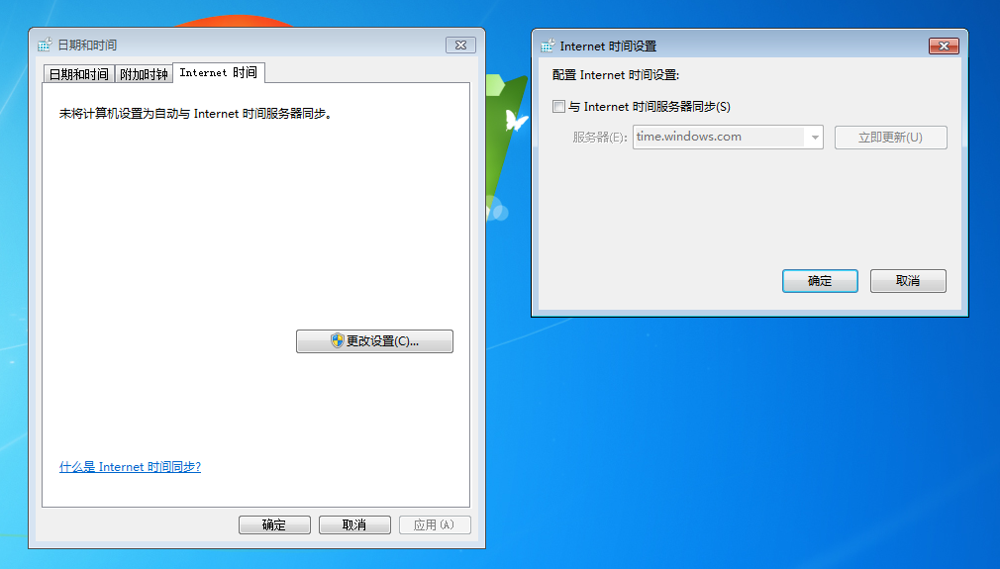
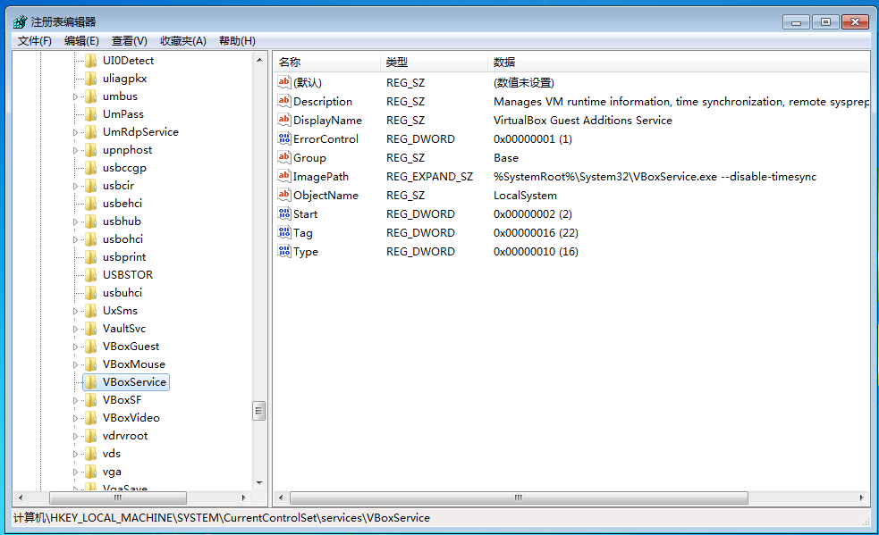

# VirtualBox虚拟机关闭时间同步

有时我们调试一些和日期相关的程序，需要调整系统时间，Windows操作系统如果联网，会自动通过微软的时间同步服务器进行网络的时间同步。如果使用的是VirtualBox，虚拟机软件还会另外注册一个服务，保持虚拟机和宿主机时间同步。如果我们要修改系统时间，必须同时关闭这两个服务。

## 关闭联网时间同步服务

在系统托盘右下角时间处单击，选择`更改时间和日期设置`，在弹出设置对话框中选择`Internet时间`选项卡，取消勾选`与Internet时间服务器同步`。

## 禁用虚拟机时间同步服务

在注册表中找到`HKEY_LOCAL_MACHINE\SYSTEM\CurrentControlSet\Services\VBoxService`，修改`ImagePath`键的值为`system32\VBoxService.exe --disable-timesync`。

以上都修改完成后，重启虚拟机，再调整时间，就不会和真实时间自动同步了。
