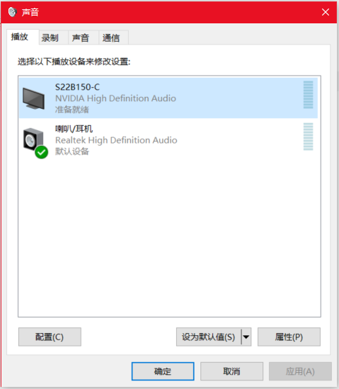

# 插入HDMI线后耳机没声音

新的笔记本电脑没有VGA接口，而老式的显示器又不支持HDMI，于是弄了个转接器，虽然偏色有点严重，不过也算能凑合着用了。但是插上HDMI线后，发现电脑连接的耳机就不出声了，这是因为HDMI既能传送视频信号，也能传送音频信号，插上HDMI线后系统自动屏蔽了耳机。要想继续使用耳机的话，这里稍微设置一下即可。

在喇叭上右键点击播放设备。

将`喇叭/耳机`设为默认值。

这样音频信号就从笔记本电脑的扬声器或连接的耳机输出，而不是HDMI。
