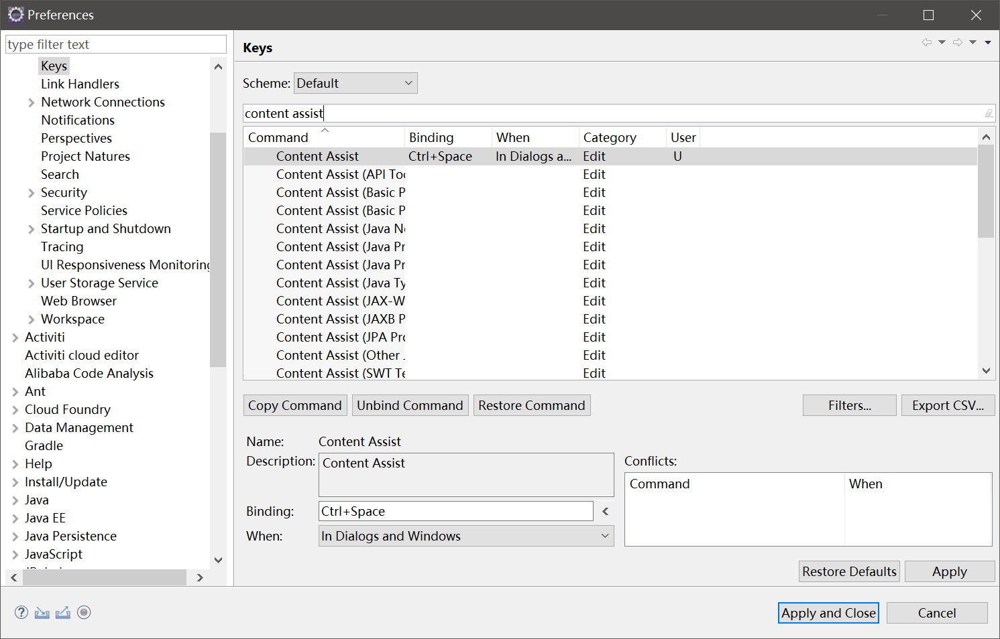
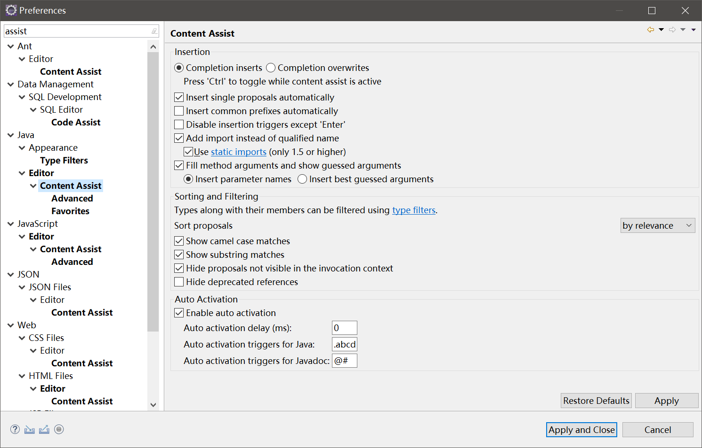

# Eclipse 代码提示修正

Eclipse默认情况下，使用`Alt+/`触发代码提示，只有`.`字符后会自动触发代码提示，这非常难用。代码提示快捷键建议修改为`Ctrl+Space`，触发字符建议改为`.abcdefghijklmnopqrstuvwxyz`，而且Intellij IDEA的代码提示触发（Eclipse键位）居然也和我的想法不谋而合。

### 快捷键修改

### 触发字符修改

