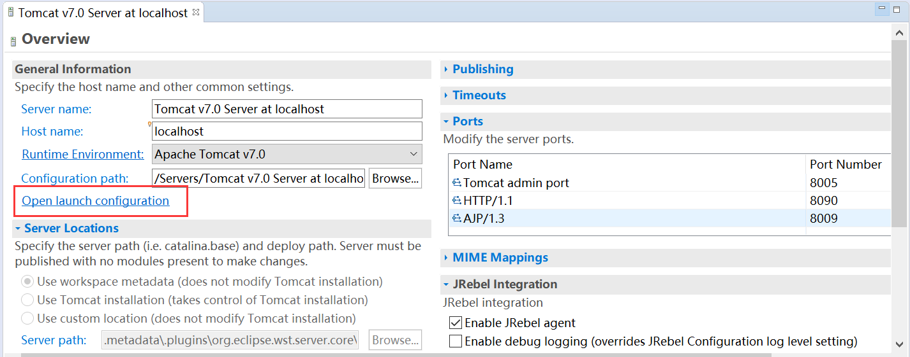
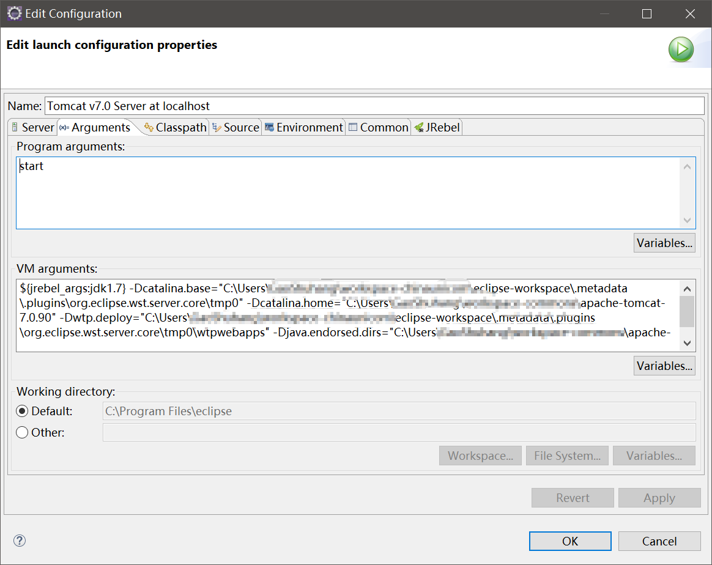

# Eclipse修改Tomcat的JVM启动参数

实际开发中，经常遇到JVM内存默认设定过小的情况（尤其是巨大的老单体应用）。Intellij IDEA改JVM启动参数的位置很明显，但是Eclipse里这个配置隐藏的很深。。。

注：这里使用的版本是最新的Eclipse 4.10，老版本或MyEclipse可能和这里不同。

VM Arguments就是我们需要修改的配置了，这里由于使用了JRebel，因此有一些额外的配置。

