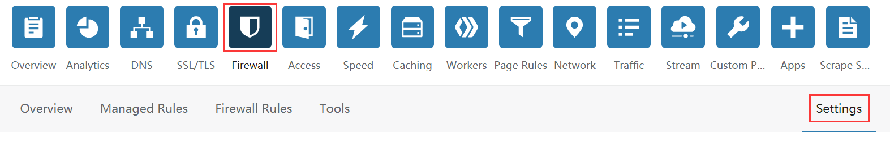

# CloudFlareCDN巨坑

CloudFlare是个相当良心的免费CDN，CDN具体用途就不多说了，这里记录一个巨坑。

我的一个网站有些HTTP请求有些来自客户端软件，而不一定都是从浏览器上发出的，结果造成的现象就是：客户端软件死活连不上，用浏览器测试却没任何问题。

我仔仔细细的检查了客户端，检查了域名的解析配置，检查了CloudFlare的配置，检查了服务器Nginx的配置（当时也是傻了，Nginx日志可能一直在跳浏览器的请求），检查了服务器防火墙的配置，检查了服务端应用的配置，客户端软件就是说啥都不好使。

最后无意中发现了CloudFlare里面`Firewall`下有好多`Block`的日志，紧接着找到了这个小小的按钮：

下面有个配置：`Browser Integrity Check`，默认是打开的！

原来是CloudFlare很聪明的把非浏览器请求给拦截了！
