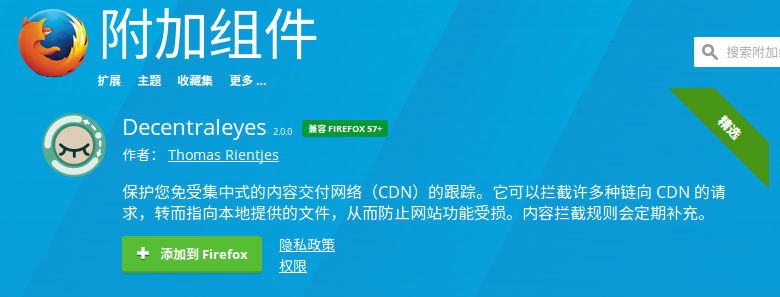

# stackoverflow等依赖google API的网站无法访问

stackoverflow依赖google API提供的JQuery，但是google API现在无法访问，stackoverflow的页面几乎无法加载。

## 解决方案

解决方法一种是将JQuery下载到本地，然后改一下hosts文件，但是这种方法问题太大了，后来找到了一种更好的办法：

firefox安装Decentraleyes插件：[https://addons.mozilla.org/zh-CN/firefox/addon/decentraleyes/?src=search](https://addons.mozilla.org/zh-CN/firefox/addon/decentraleyes/?src=search)

